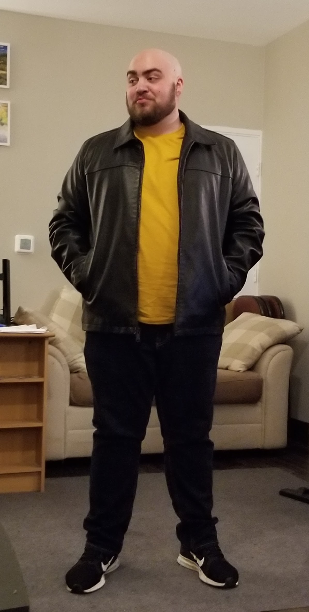
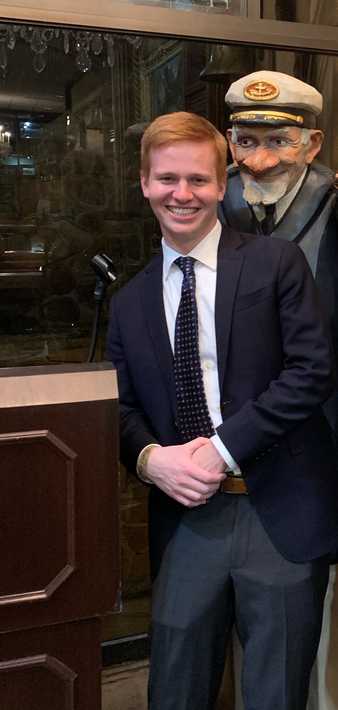
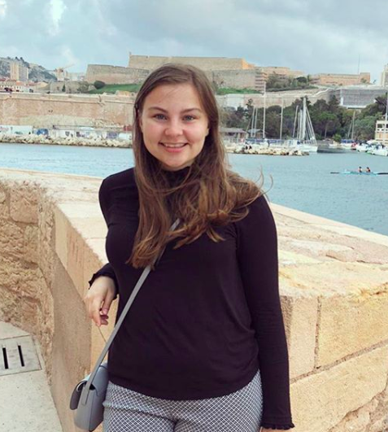

# Meet the CrowdClimbz Team
---

### Bailey Gulsby
<!-- .element height="20%" width="20%" -->

My name is Bailey Gulsby, and I am studying computer science at the University of Alabama. My development experience includes my class projects and a couple of projects with Dr. Carver and the School of Social Work building web and mobile apps. Outside of software development I enjoy traveling with friends and playing Super Smash Bros. Ultimate with my roommates. I have had the chance to travel to many interesting places including New Orleans, Atlanta, Pensacola, and Tijuana. In May I will be graduating and working full-time in Huntsville, AL with 3-GIS.

### William Harders
<!--  -->

I'm Will Harders and I am a senior student in the Capstone Computing course.  I am majoring in Computer Science and Mathematics and will be graduating this spring.  Outside of my classes, I love playing tennis as well as listening to music and playing video games.  I am hoping to go into Data Science or some other field that combines Computer Science and Mathematics post-graduation.  

### Emma Ingram
<!--  -->

I’m a senior studying computer science, mathematics and French. During my time as a university student, I have had the opportunity to participate in an NSF-funded research project studying graph theory, study abroad in Grenoble France, and intern at both an investment bank and a hedge fund in New York City. On campus I’m a member of the Culverhouse Investment Management Group and I lead tours as an Ambassador to the College of Engineering. Since I was living in France studying French language and culture full-time last semester, this project will be an interesting opportunity to dive back into my computer science studies. When I’m not working on schoolwork or coding I enjoy playing piano and board games.

### Laura Silvashy
<!-- .element height="50%" width="50%" -->

Hi, I'm Laura Silvashy, and I'm studying computer science and mathematics at the University of Alabama. When I'm not diligently working on my CS 495 project, I can often be found rock climbing or working at my job with Outdoor Recreation on campus. I am also very involved with my church in Tuscaloosa. I love spending time outside, playing board games, and rewatching *The Office* on Netflix. After I graduate in May, I will be moving to Cincinnati, getting married to my amazing fiancé, Stephen, and starting a job as a data scientist at 84.51&deg;.

---
[Home](https://cbgulsby.github.io/CrowdClimbz/)
